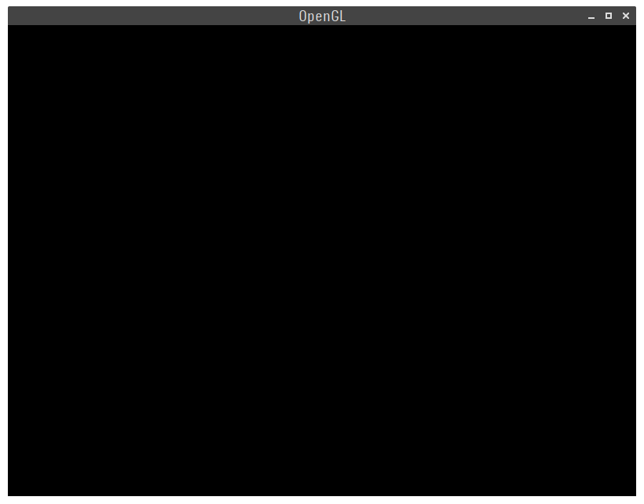
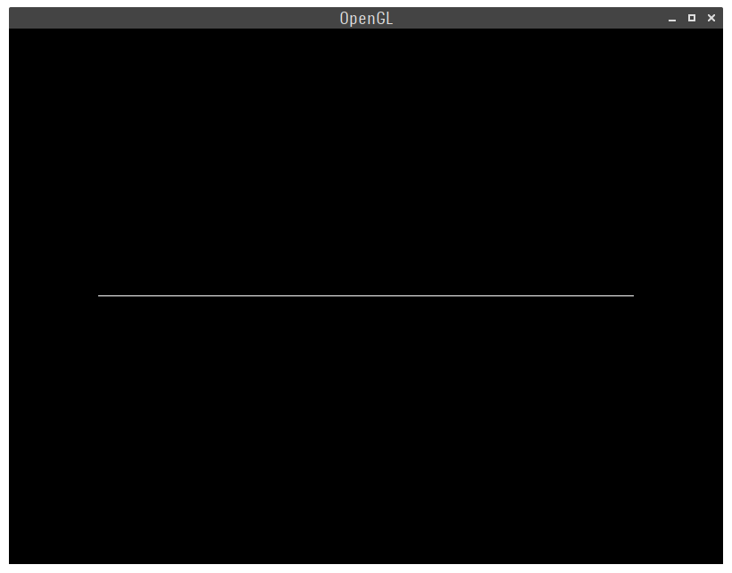
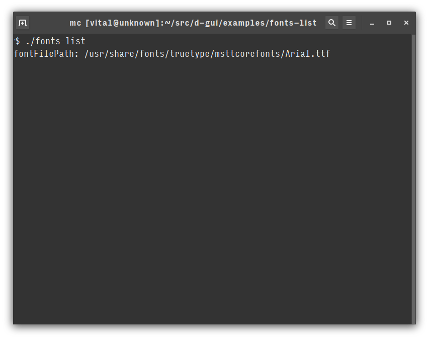

# Examples

## window
```D
    import ui.window;

    auto window = createMainWindow( 800, 600, "OpenGL" );
```


## line
```D
    import ui.line;

    drawLine( 100, 300, 700, 300, 1.0f, 1.0f, 1.0f );
```


## fonts
```D
    import ui.fonts;


    auto fontFilePath = 
        queryFont( 
            /* family  */ "arial".toStringz,
            /* style   */ 0, 
            /* height  */ 16, 
            /* slant   */ 0, 
            /* outline */ 0.0f
        );

    printf( "fontFilePath: %s\n", fontFilePath );

    free( fontFilePath );
```


